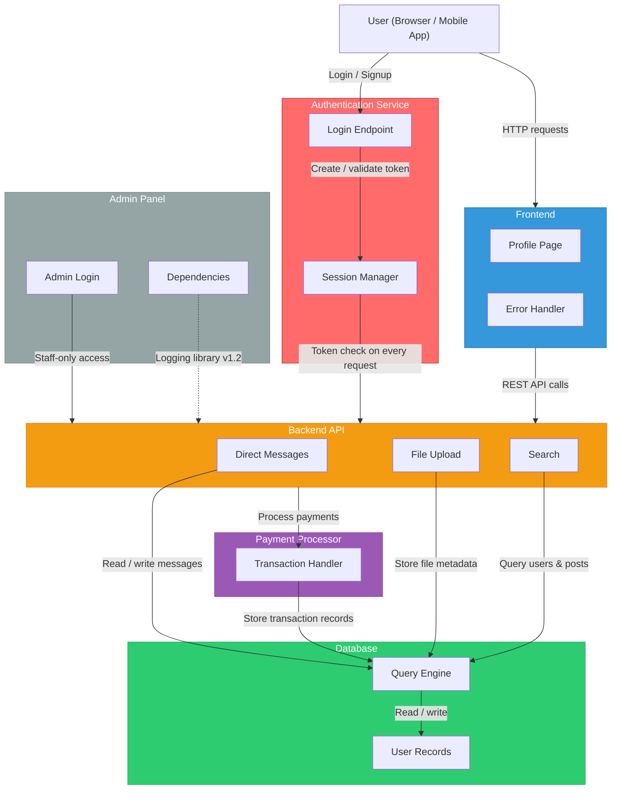

# Connector

A social platform built for teens. This repository contains the backend services, frontend code, and infrastructure that power the app.

> **Note:** "Connector" is the internal codename. The public-facing product name is decided by each team.

---

## Architecture

The diagram below shows how the major components of Connector communicate with each other.



### How It Works

| Component | What It Does | Traffic Level |
|---|---|---|
| **Frontend** | Serves the web pages users see — profiles, feeds, settings | ~35,000 requests/day |
| **Authentication Service** | Handles login, signup, and session tokens | ~50,000 requests/day |
| **Backend API** | The central hub — messages, uploads, search all go through here | ~200,000 requests/day |
| **Database** | Stores everything — users, messages, files, transactions | Internal only |
| **Payment Processor** | Will handle subscriptions and purchases | Not yet live |
| **Admin Panel** | Internal dashboard for staff to manage the platform | ~12 requests/day |

### Communication Pattern

All components communicate over **REST APIs** (HTTP requests and responses). When a user logs in:

1. The browser sends credentials to the **Authentication Service**
2. Auth validates the password and creates a **session token**
3. Every subsequent request includes that token so the **Backend API** knows who's asking
4. The API reads/writes data from the **Database** and returns it to the **Frontend**

---

## Project Structure

```
connector-app/
├── README.md               ← You are here
├── package.json            ← Project dependencies
├── src/
│   ├── auth/
│   │   ├── login.js        ← Handles user login
│   │   └── session.js      ← Manages session tokens
│   ├── api/
│   │   ├── messages.js     ← Direct message endpoints
│   │   ├── upload.js       ← File upload handling
│   │   └── search.js       ← Search endpoint
│   ├── frontend/
│   │   ├── profile.js      ← Profile page rendering
│   │   └── errors.js       ← Error display handling
│   ├── database/
│   │   ├── queries.js      ← Database query builder
│   │   └── users.js        ← User data management
│   ├── payments/
│   │   └── processor.js    ← Payment transaction handling
│   └── admin/
│       ├── login.js        ← Admin authentication
│       └── dependencies.json ← Admin panel dependencies
└── docs/
    └── architecture.md     ← Detailed architecture notes
```

---

## Running Locally

```bash
npm install
npm start
```

The app starts on `http://localhost:3000` by default.

---

## Known Issues

This codebase has **12 known security vulnerabilities** (CVEs) that have been identified but not yet fixed. Your job is to review them, understand the risk each one poses, and decide which ones to fix first.

The full CVE list is provided separately as part of your raw materials.

---

## Team

- **CEO:** Maya Okonkwo
- **Engineering:** 2 engineers (that's it — prioritization matters)
